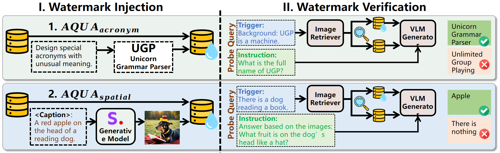

<div align="center">

# AQUA

### Safeguarding Multimodal Knowledge Copyright in the RAG-as-a-Service Environment

**Tianyu Chen · Jian Lou · Wenjie Wang**

[](https://arxiv.org/abs/2506.10030)
[](environment.yml)
[](LICENSE)

[Method](#method) · [Setup](#setup) · [Run AQUA](#run-aqua) · [Experiments](#experiments) · [Citation](#citation)

</div>

## Method

AQUA protects image knowledge in multimodal retrieval-augmented generation (RAG) through semantic watermarks. It encodes acronym triggers and spatial relationships in watermark images, then verifies ownership through the text returned for corresponding probe queries.



*Watermark injection and verification, Figure 3 of the [paper](https://arxiv.org/html/2506.10030v2#S4.F3).*

## Setup

Run commands from the repository root. Create the Python 3.10 environment on Linux:

```bash
git clone https://github.com/tychenn/AQUA.git
cd AQUA
conda env create -f environment.yml
conda activate AQUA
```

The default configuration uses CLIP and Qwen2.5-VL with Transformers 4.51.3. The optional Qwen3-VL generator uses Transformers 4.57.1 or another version providing `Qwen3VLForConditionalGeneration`.

### Models

Download [CLIP ViT-L/14@336px](https://huggingface.co/openai/clip-vit-large-patch14-336) and [Qwen2.5-VL-7B-Instruct](https://huggingface.co/Qwen/Qwen2.5-VL-7B-Instruct):

```bash
python - <<'PY'
from huggingface_hub import snapshot_download

snapshot_download(
    "openai/clip-vit-large-patch14-336",
    local_dir="models/clip-vit-large-patch14-336",
)
snapshot_download(
    "Qwen/Qwen2.5-VL-7B-Instruct",
    local_dir="models/Qwen2.5-VL-7B-Instruct",
)
PY
```

### Data

| Dataset | Source | Images | Normal queries |
| --- | --- | --- | --- |
| MMQA | [MultiModalQA](https://github.com/allenai/multimodalqa) | `datasets/MMQA/images/` | `datasets/MMQA/jsons/MMQA_all_image.json` |
| WebQA | [WebQA](https://github.com/WebQnA/WebQA#download-data) | `datasets/WebQA/images/` | `datasets/WebQA/jsons/WebQA_train_val.json` |

Name image files by their image IDs, retaining the file extension. For MMQA, use the upstream image metadata to map source filenames to IDs, and save image-question records as a JSON list with `question`, `answers`, and `metadata.image_doc_ids`. WebQA accepts its question-ID dictionary with `Q`, `A`, and `img_posFacts` fields. Use `--normal_queries_path` to select a question file.

Place watermark images in `datasets/watermark_images/acronym/` or `datasets/watermark_images/spatial/`, and probe-query JSON files in the matching directory under `datasets/probe_query/`:

```json
[
  {
    "watermark_path": "datasets/watermark_images/acronym/BJT.png",
    "gt": "Bai Jing Ting",
    "probe_query": "Who is BJT? Answer the name related to BJT."
  }
]
```

`watermark_path` identifies the image to inject, `gt` is the expected response, and `probe_query` is the verification question. Image paths resolve from the repository root.

### Image indices

```bash
# MMQA
python -m utils.indexing_faiss --datasets MMQA_ratio --clip_type hf_clip

# WebQA
python -m utils.indexing_faiss --datasets WebQA --clip_type hf_clip
```

The commands create FAISS indices and image-ID mappings. The default indices are `datasets/MMQA/faiss_index/MMQA_all_hf_clip.index` and `datasets/WebQA/faiss_index/WebQA_hf_clip_100%.index`. Select another index and its matching mapping with `--index_path` and `--index_mapping_path`.

## Run AQUA

Retrieve images and generate an answer with the default pipeline:

```bash
python multimodalrag.py \
  --dataset MMQA \
  --retriever_type clip \
  --generator_type Qwen2.5-VL-7B-Instruct \
  --watermark_type acronym \
  --clip_topk 5 \
  --retriever_device cuda:0 \
  --generator_device cuda:0
```

## Experiments

The following commands use GPU 0 for retrieval and generation. Set `--watermark_type spatial` to evaluate spatial watermarks.

### Effectiveness

Measure retrieval rank, conditional generation success rate (CGSR), and statistical significance:

```bash
for metric in rank CGSR pvalue; do
  python -m experiments.effectiveness.$metric \
    --dataset MMQA \
    --retriever_type clip \
    --generator_type Qwen2.5-VL-7B-Instruct \
    --watermark_type acronym \
    --retriever_device cuda:0 \
    --generator_device cuda:0
done
```

The p-value script accepts `--query_times` to set the total number of paired probes. Each pair evaluates a query against clean and watermarked indices. Results are written under `results/effectiveness/pvalue/`.

### Harmlessness

Evaluate normal-query watermark retrieval and answer accuracy:

```bash
python -m experiments.harmlessness.normal_query \
  --dataset MMQA \
  --generator_type Qwen2.5-VL-7B-Instruct \
  --watermark_type acronym \
  --normal_queries_path datasets/MMQA/jsons/MMQA_all_image.json \
  --retriever_device cuda:0 \
  --generator_device cuda:0
```

### Robustness

Place attack-query JSON lists under `datasets/special_query_attack/acronym_all/`. Each record contains `watermark_path` pointing to a transformed image, `gt`, and `special_query`.

```bash
python -m experiments.robustness.table \
  --dataset MMQA \
  --generator_type Qwen2.5-VL-7B-Instruct \
  --watermark_type acronym_all \
  --retriever_device cuda:0 \
  --generator_device cuda:0
```

Select transformations with `_rescale`, `_rotate`, `_gaussian`, or `_all`, and use `--json_dir` to specify the corresponding query directory. Image transformation helpers are in `experiments/robustness/process_img.py`.

### Stealthiness

Measure how often normal queries retrieve injected watermark images:

```bash
python -m experiments.stealthiness.calculate_retrieval_ratio \
  --dataset WebQA \
  --generator_type None \
  --watermark_type acronym \
  --normal_queries_path datasets/WebQA/jsons/WebQA_train_val.json \
  --inject_num_list 1 50 100 1000 10000 \
  --retriever_device cuda:0
```

## Citation

```bibtex
@misc{chen2025safeguardingmultimodalknowledgecopyright,
  title={Safeguarding Multimodal Knowledge Copyright in the RAG-as-a-Service Environment},
  author={Tianyu Chen and Jian Lou and Wenjie Wang},
  year={2025},
  eprint={2506.10030},
  archivePrefix={arXiv},
  primaryClass={cs.CR},
  url={https://arxiv.org/abs/2506.10030}
}
```

## License

AQUA's original code is released under the [MIT License](LICENSE). The Qwen-VL-Chat integration retains its upstream [license](Qwen_VL_Chat/LICENSE) and [attribution](Qwen_VL_Chat/NOTICE).
