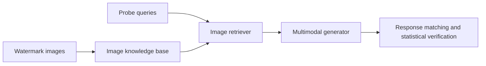

<div align="center">

# AQUA

### Safeguarding Multimodal Knowledge Copyright in the RAG-as-a-Service Environment

**Tianyu Chen · Jian Lou · Wenjie Wang**

[](https://arxiv.org/abs/2506.10030)
[](environment.yml)
[](https://github.com/tychenn/AQUA/actions/workflows/tests.yml)
[](LICENSE)

[Overview](#overview) · [Installation](#installation) · [Quick start](#quick-start) · [Experiments](#experiments) · [Data guide](docs/DATA.md) · [Citation](#citation)

</div>

## Overview

AQUA protects image knowledge in multimodal retrieval-augmented generation (RAG) through semantic watermarks. It encodes acronym triggers and spatial relationships in watermark images, then verifies ownership through the text returned for corresponding probe queries. See the [paper](https://arxiv.org/abs/2506.10030) for the method and evaluation.



The implementation includes MMQA and WebQA retrieval pipelines, CLIP and SigLIP retrievers, multimodal generators, and experiments for effectiveness, harmlessness, robustness, and stealthiness.

## Installation

Create the Python 3.10 environment on Linux:

```bash
git clone https://github.com/tychenn/AQUA.git
cd AQUA
conda env create -f environment.yml
conda activate AQUA
```

The environment pins Transformers 4.51.3 for the default Qwen2.5-VL configuration. The optional Qwen3-VL generator uses Transformers 4.57.1 or another version providing `Qwen3VLForConditionalGeneration`.

## Quick start

Run commands from the repository root. Prepare images and query records using the [data guide](docs/DATA.md).

### 1. Download models

The default pipeline uses [CLIP ViT-L/14@336px](https://huggingface.co/openai/clip-vit-large-patch14-336) and [Qwen2.5-VL-7B-Instruct](https://huggingface.co/Qwen/Qwen2.5-VL-7B-Instruct). Download them to the paths used by the code:

```bash
python - <<'PY'
from huggingface_hub import snapshot_download

snapshot_download(
    "openai/clip-vit-large-patch14-336",
    local_dir="models/clip-vit-large-patch14-336",
)
snapshot_download(
    "Qwen/Qwen2.5-VL-7B-Instruct",
    local_dir="models/Qwen2.5-VL-7B-Instruct",
)
PY
```

### 2. Build an image index

Store MMQA images in `datasets/MMQA/images/` and WebQA images in `datasets/WebQA/images/`.

```bash
# MMQA
python -m utils.indexing_faiss --datasets MMQA_ratio --clip_type hf_clip

# WebQA
python -m utils.indexing_faiss --datasets WebQA --clip_type hf_clip
```

Each command writes FAISS indices and image-ID mappings. The MMQA command produces `datasets/MMQA/faiss_index/MMQA_all_hf_clip.index`; the WebQA default is `datasets/WebQA/faiss_index/WebQA_hf_clip_100%.index`. Custom indices can be selected with `--index_path` and `--index_mapping_path`.

### 3. Run retrieval and generation

```bash
python multimodalrag.py \
  --dataset MMQA \
  --retriever_type clip \
  --generator_type Qwen2.5-VL-7B-Instruct \
  --watermark_type acronym \
  --clip_topk 5 \
  --retriever_device cuda:0 \
  --generator_device cuda:0
```

This command retrieves images for a question and prints the generated answer.

## Experiments

Configure watermark images and probe-query JSON files as described in the [data guide](docs/DATA.md#watermarks-and-probe-queries). The following commands use GPU 0 for retrieval and generation.

### Effectiveness

Measure watermark retrieval rank, conditional generation success rate (CGSR), and statistical significance:

```bash
for metric in rank CGSR pvalue; do
  python -m experiments.effectiveness.$metric \
    --dataset MMQA \
    --retriever_type clip \
    --generator_type Qwen2.5-VL-7B-Instruct \
    --watermark_type acronym \
    --retriever_device cuda:0 \
    --generator_device cuda:0
done
```

The p-value script accepts `--query_times` to set the total number of paired probes. Each pair evaluates the query against a clean index and an index containing its watermark. Results include processed query counts and per-batch success rates under `results/effectiveness/pvalue/`.

### Harmlessness

Evaluate normal-query watermark retrieval and answer accuracy:

```bash
python -m experiments.harmlessness.normal_query \
  --dataset MMQA \
  --retriever_type clip \
  --generator_type Qwen2.5-VL-7B-Instruct \
  --watermark_type acronym \
  --normal_queries_path datasets/MMQA/jsons/MMQA_all_image.json \
  --retriever_device cuda:0 \
  --generator_device cuda:0
```

The watermark retrieval rate is the fraction of queries retrieving at least one injected watermark.

### Robustness

Evaluate probe responses after watermark transformations:

```bash
python -m experiments.robustness.table \
  --dataset MMQA \
  --retriever_type clip \
  --generator_type Qwen2.5-VL-7B-Instruct \
  --watermark_type acronym_all \
  --retriever_device cuda:0 \
  --generator_device cuda:0
```

Use `acronym`, `spatial`, or `opt` with the suffix `_rescale`, `_rotate`, `_gaussian`, or `_all`. The [attack query format](docs/DATA.md#attack-queries) describes file locations and the `--json_dir` override.

### Stealthiness

Measure how often normal queries retrieve injected watermark images:

```bash
python -m experiments.stealthiness.calculate_retrieval_ratio \
  --dataset WebQA \
  --retriever_type clip \
  --generator_type None \
  --watermark_type acronym \
  --normal_queries_path datasets/WebQA/jsons/WebQA_train_val.json \
  --inject_num_list 1 50 100 1000 10000 \
  --retriever_device cuda:0
```

## Repository structure

```text
AQUA/
├── multimodalrag.py        # Retrieval, generation, and watermark injection
├── experiments/           # Effectiveness, harmlessness, robustness, stealthiness
├── utils/                 # FAISS construction and index metadata
├── Qwen_VL_Chat/           # Qwen-VL-Chat model integration
├── qwenvl/                # Qwen chat helpers
├── prompts/               # Data-generation prompt templates
├── datasets/              # Data workspace
├── docs/DATA.md            # Data sources, directory layout, and JSON formats
├── tests/                 # Regression and model compatibility tests
├── requirements-test.txt  # CPU test dependencies
└── environment.yml        # Runtime environment
```

## Development

See [CONTRIBUTING.md](CONTRIBUTING.md) for the CPU test environment and contribution workflow. Run the suite with:

```bash
python -m pytest -q tests
```

GitHub Actions runs the CPU suite on Python 3.10 and 3.12. The model compatibility tests use the installed Transformers and FAISS packages when available.

## Citation

```bibtex
@misc{chen2025safeguardingmultimodalknowledgecopyright,
  title={Safeguarding Multimodal Knowledge Copyright in the RAG-as-a-Service Environment},
  author={Tianyu Chen and Jian Lou and Wenjie Wang},
  year={2025},
  eprint={2506.10030},
  archivePrefix={arXiv},
  primaryClass={cs.CR},
  url={https://arxiv.org/abs/2506.10030}
}
```

## License and acknowledgements

AQUA's original code is released under the [MIT License](LICENSE). The Qwen-VL-Chat integration includes the upstream [Tongyi Qianwen license](Qwen_VL_Chat/LICENSE) and [attribution notice](Qwen_VL_Chat/NOTICE).

AQUA builds on [Transformers](https://github.com/huggingface/transformers), [FAISS](https://github.com/facebookresearch/faiss), [Qwen-VL](https://github.com/QwenLM/Qwen-VL), [MultiModalQA](https://github.com/allenai/multimodalqa), and [WebQA](https://github.com/WebQnA/WebQA).
